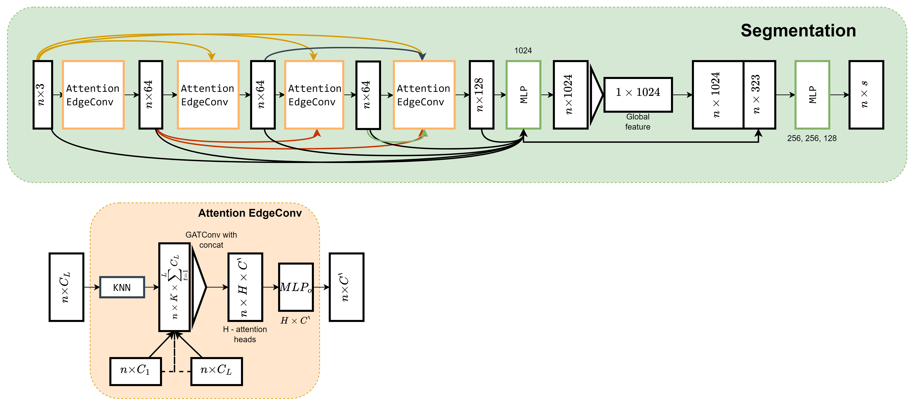

# Overview
This repository contains an implementation of the LDGCNN model ([paper](https://arxiv.org/abs/1904.10014)) with the GATConv Layer ([paper](https://arxiv.org/abs/1710.10903)) and GATv2Conv ([paper](https://arxiv.org/abs/2105.14491)), which replaces the standard GCN layer. </br>
For simplicity, mentioned models are named as **LDGATv1** and **LDGATv2** accordingly.</br>

# Model architecture
Mostly, the model is similar to LDGCNN, but as mentioned above GCN layer was replaced with the GATConv layer. The output of this layer is from multiple attention heads, and because of that in convolution layer additional MLP layer is used.



# Results

## ShapeNet

For training on synthetic data was used the ShapeNet part level segmentation dataset from the “[A Scalable Active Framework for Region Annotation in 3D Shape Collections](https://web.stanford.edu/~ericyi/papers/part_annotation_16_small.pdf)” paper using Pytorch Geometric implementation ([link](https://pytorch-geometric.readthedocs.io/en/2.5.3/generated/torch_geometric.datasets.ShapeNet.html)).

Used configuration:

|                                         | LDGCNN   | LDGCNN with GATConv | LDGCNN with GATv2Conv |
|-----------------------------------------|----------|---------------------|-----------------------|
| Epochs                                  | 50       | 50                  | 50                    |
| Batch size                              | 3        | 5                   | 5                     |
| Optimizer                               | Adam     | Adam                | Adam                  |
| Learning rate                           | 0.0001   | 0.0001              | 0.0001                |
| Loss function                           | NLL loss | NLL loss            | NLL loss              |
| Nearest neighbours for creating a graph | 20       | 20                  | 20                    |
| Aggregation function                    | Max      | -                   | -                     |
| Number of attention heads               | -        | 4                   | 4                     |

Results:

| Metric   | LDGCNN | LDGCNN with GATConv | LDGCNN with GATv2Conv |
|----------|--------|---------------------|-----------------------|
| Accuracy | 0.853  | 0.797               | 0.805                 |
| mIoU     | 0.678  | 0.636               | 0.636                 |

## KITTI-360

For training on KITTI-360 dataset ([link](http://www.cvlibs.net/datasets/kitti-360)) firstly, whole scenes were tiled in 5x5 squares with the random subsampling for each tile to 8192 points. </br>
Some points to mention:
- Classes number was used according to SPT (Superpoint Transformer) [configuration](https://github.com/drprojects/superpoint_transformer/blob/6cb9d930870a69c54a10be0233c156259a42e067/src/datasets/kitti360_config.py#L14).
- Classes weights were calculated using sklearn [compute_classes_weights](https://scikit-learn.org/stable/modules/generated/sklearn.utils.class_weight.compute_class_weight.html) according to the number of points for each class. You can check them in [kitti_labels_weights_spt.py](components%2Fcommon%2Fkitti_labels_weights_spt.py) 

Training configuration:

|                                         | LDGCNN with GATConv | LDGCNN with GATv2Conv |
|-----------------------------------------|---------------------|-----------------------|
| Epochs                                  | 75                  | 75                    |
| Batch size                              | 1                   | 1                     |
| Optimizer                               | Adam                | Adam                  |
| Learning rate                           | 0.0005              | 0.0005                |
| Loss function                           | NLL loss            | NLL loss              |
| Nearest neighbours for creating a graph | 30                  | 30                    |
| Number of attention heads               | 6                   | 6                     |

Results with mean metrics:

| Metric    | LDGCNN with GATConv | LDGCNN with GATv2Conv |
|-----------|---------------------|-----------------------|
| Accuracy  | 0.596               | 0.738                 |
| Recall    | 0.259               | 0.359                 |
| Precision | 0.242               | 0.325                 |
| F1        | 0.250               | 0.341                 |
| IoU       | 0.162               | 0.269                 |


# Running the code

1. Add your ClearML credentials to [clear_ml_secret.py](clear_ml_secret.py) for tracking your experiments. Currently, it doesn't work without ClearML integration.
2. Next, you need to configure a training process using the configuration file ([train_config.json](train_config.json)): </br>
    Choose the dataset for training in the following section:
    ```
    ...
      "dataset_config": {
        "dataset_to_use": "kitti",
    ...
    ```
    ShapeNet dataset will be downloaded automatically using Pytorch Geometric.
    KITTI-360 dataset can be downloaded only manually from this [link](https://www.cvlibs.net/datasets/kitti-360/). Then dataset files need to be placed in `raw` folder, which is subfolder of the provided in `dataset_path` folder. For example, if `"dataset_path": "data/kitti_360"`:
   ```
      ├── data
      │   ├── kitti_360
      │   │   ├── raw
      │   │   │   ├── data_3d_semantics
      │   │   │   │   ├── train
      │   │   │   │   │   ├── 2013_05_28_drive_0000_sync
      │   │   │   │   │   ├── 2013_05_28_drive_0002_sync
      ...
      │   │   │   │   │   ├── 2013_05_28_drive_train.txt
      │   │   │   │   │   ├── 2013_05_28_drive_val.txt
   ```

3. Configure chosen dataset:
    - For ShapeNet can be chosen which category to use for training in `category_to_use` section and folder for downloading `dataset_path` section.
    - For KITTI-360 there are a few more options to configure.
      - As whole scenes are tiled for training, you can choose how splits are made without overlapping (`"cell_split_type": "full_step"`) or with overlap (`"cell_split_type": "with_stride"`) - then you also need to specify `stride` option.
      - Also, for tiling `grid_size` option is required. This option is responsible for the size of each tile in a global coordinate system.
      - Option `cloud_size_threshold` is responsible for the filtering small tiles. Tiles which are smaller than this threshold will be accumulated with the nearest tile.
      - Option `out_cloud_size` is responsible for the number of points in each tile. If tile is larger than this threshold, it will be downsampled to this number of points.
4. Then you need to specify which model to use for training in the following section:
    ```
      "train_model_config": {
        "model_to_use": "ldgat_v1",
    ```
5. Configure chosen model:
    - For each model you can specify the number of nearest neighbours to form a graph (option `k`).
    - For LDGCNN you can specify the type of aggregation function (check [link](https://pytorch-geometric.readthedocs.io/en/latest/generated/torch_geometric.nn.conv.EdgeConv.html)). Can be one of the next values: `add`, `mean` or `max`.
    - For LDGCNN with attention convolution (`ldgat_v1` and `ldgat_v1`) you can specify the number of attention heads to use.
6. The next section is responsible for configuring a training process. Most of the options are basic for the deep learning training process. Several options are worth to be mentioned:
    - Option `acc_gradients_iter` is responsible for the gradient accumulation. If not `null` gradient from the loss will be propagated each specified epoch but not every epoch.
    - `optimizer` and `lr_scheduler` can be chosen from Pytorch.

For training, run the following script:
```bash
python train_model.py [-c config] [-task task_name] [-tags]
```
Flag -c: Path to the config file (training_config.json).</br>
Flag -task: A name for a task for ClearML.</br>
Flag -tags: optional, tags for clear ml experiment.
